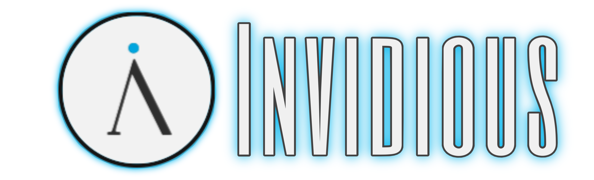

  
    

  <h1>⏯️ • Invidious 
      🗿 » Home Assistant🏡
          <b>Addon</b> Edition</h1>
  
  | Logo | Add-on |
  |:----:|:---|
  |  | [**Invidious**](./invidious) |

> [!CAUTION]
> Everything is **work in progress**! Most stuff won't work or runs **unstable**!

## Installation (Easy)

## Installation (Manual)
» Add this Repository to Home Assistant:
   - Settings > Add-Ons > Add-On Store
   -  _(top right corner)_ > Repositories > Enter URL: `https://github.com/elias1731/individious_hass`
   - **+ Add**

---

> [!NOTE]
> Refresh the Add-On Store Page after adding the repo to avoid caching issues

# License

[MIT](LICENSE)